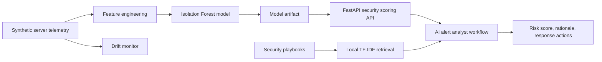

# InfraSentinel AI Security

Open-source machine learning and AI platform for defensive infrastructure and server security. InfraSentinel detects anomalous server activity, scores operational risk, enriches alerts with explainable signals, and exposes a production-style API for security teams.

Built on May 18, 2026 with a modern Python stack: FastAPI, Pydantic v2 settings, scikit-learn anomaly detection, Typer CLI, pytest, Docker, and GitHub Actions.

## What It Does

- Generates safe synthetic Linux server telemetry for development and demos.
- Trains an anomaly detection model for infrastructure security events.
- Scores server activity using ML probability, deterministic security rules, and explainable signals.
- Detects suspicious patterns such as brute-force behavior, privilege escalation indicators, abnormal network egress, and unusual process activity.
- Provides a FastAPI service for real-time event scoring and analyst-ready alert summaries.
- Includes local retrieval over security playbooks for grounded remediation guidance.
- Produces drift reports so teams can see when server behavior changes.
- Ships with tests, CI, Docker, documentation, model card, data card, and security policy.

## Architecture



## Quickstart

```bash
python -m venv .venv
source .venv/bin/activate  # Windows: .venv\Scripts\activate
pip install -e ".[dev]"
make bootstrap
make test
make run-api
```

Open `http://localhost:8000/docs` after the API starts.

## CLI

```bash
infrasentinel generate-data --rows 6000
infrasentinel train
infrasentinel evaluate
infrasentinel drift-report
infrasentinel sample-event
infrasentinel serve
```

## Example API Request

```bash
curl -X POST http://localhost:8000/v1/analyze \
  -H "Content-Type: application/json" \
  -d '{
    "host_id": "srv-prod-042",
    "cpu_percent": 87.5,
    "memory_percent": 79.2,
    "failed_ssh_logins": 18,
    "successful_ssh_logins": 1,
    "sudo_commands": 9,
    "new_user_created": true,
    "process_count": 342,
    "outbound_connections": 125,
    "bytes_out_mb": 920.4,
    "listening_ports": 18,
    "package_install_count": 4,
    "hour_of_day": 3,
    "is_weekend": false
  }'
```

## Repository Layout

```text
infra-sentinel-ai-security/
|-- .github/workflows/ci.yml
|-- docs/
|-- src/infrasentinel_ai/
|-- tests/
|-- data/
|-- artifacts/
|-- Dockerfile
|-- docker-compose.yml
|-- Makefile
`-- pyproject.toml
```

## Validation

```bash
pytest
ruff check .
mypy src
```

## Security Scope

This project is defensive. It focuses on anomaly detection, alert triage, and remediation guidance. It does not include exploit code, credential theft, evasion logic, persistence tooling, or offensive automation.
